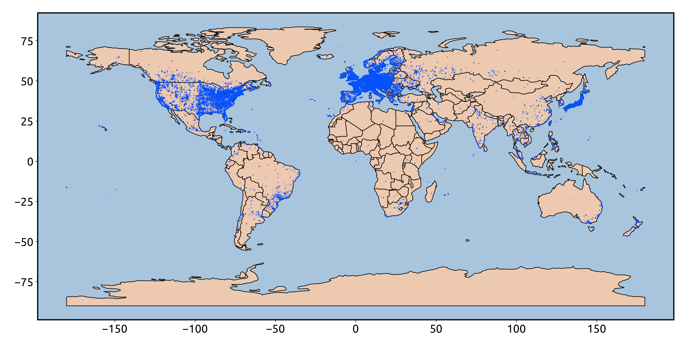

# ipmapper
A library to create maps based on a list of IP addresses

### Contact Sukrit (sukritsingh92@gmail.com) for questions/ideas!

## Dependencies
This whole repository is intended to be lightweight, but there are some critical
dependences. In particular, the python libraries needed are:
1. Numpy
2. Geopandas
3. Matplotlib

## Usage
Free to use and download. Please use with attribution/linking. 

## How to prep IP addresses
For now the `create-map.py` script is expecting a simple txt file that can be
loaded via `numpy.loadtxt`. This text file should just be a list of all IP
addresses of interest, each on their own line. A sample output
are in the `test/` directory. For security reasons, a test-ip file will be included later.

## Usage of run script
`python ipmapper/ipmapper/run/create-map.py test-ips.txt`
(Please note that this run script also contains functions that can be
imported if desired)

## Where does the DB come from?
The database is taken from MaxMind's free city lookup database. You can get your
own by making a free account.

